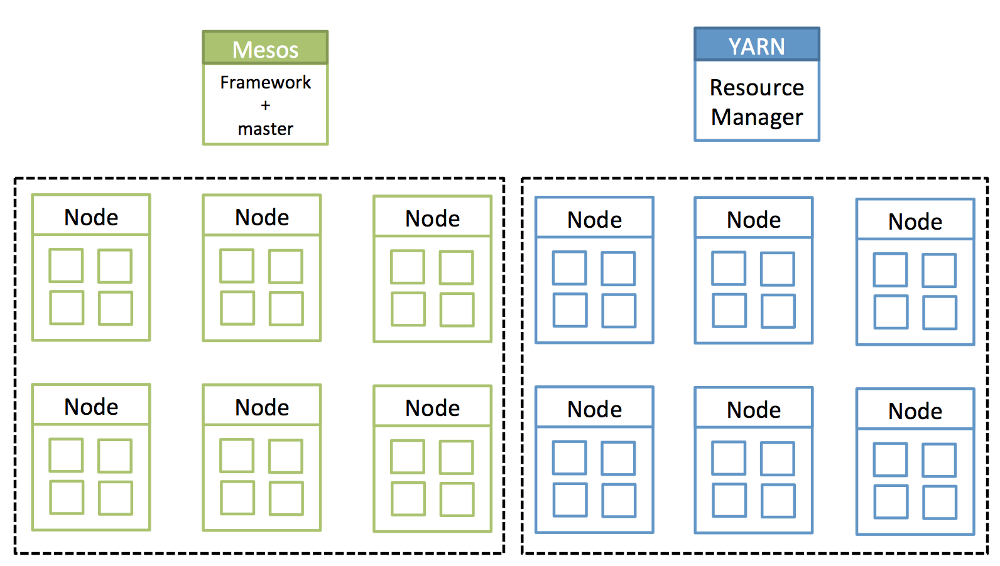

# Myriad

[](https://travis-ci.org/mesos/myriad)

Myriad is a mesos framework designed for scaling YARN clusters on Mesos. Myriad can expand or shrink one or more YARN clusters in response to events as per configured rules and policies.

The name _Myriad_ means, _countless or extremely great number_. In context of the project, it allows one to expand overall resources managed by Mesos, even when the cluster under mesos management runs other cluster mangaers like YARN.

## Introduction

Myriad allows Mesos and YARN to co-exist and share resources with Mesos as the resource manager for the datacenter. Sharing resources between these two resource allocation systems improves overall cluster utilization and avoids statically partitioning resources amongst two separate clusters/resource managers.

Running two resource managers independently results in a statically partitioned datacenter as shown below:



**Please note: Myriad is a work in progress, and should not be used in production at this point.**

## Roadmap
Myriad is a work in progress, please keep checking this section for updates.

- [ ] Support multiple clusters
- [ ] Custom Executor for managing NodeManager
- [ ] Support multi-tenancy for node-managers
- [ ] Support unique constraint to let only one node-manager run on a slave
- [ ] Configuration store for storing rules and policies for clusters managed by Myriad
- [ ] NodeManager Profiles for each cluster
- [ ] High Availability mode for framework
- [ ] Framework checkpointing
- [ ] Framework re-conciliation

## Build instructions
System requirements:
* JDK 1.8+
* Gradle

To build project run:
```bash
gradle build
```

To build a self-contained jar, run:
```bash
gradle capsule
```

To run project:
```bash
export MESOS_NATIVE_JAVA_LIBRARY=/usr/local/lib/libmesos.so
# On Mac: export MESOS_NATIVE_JAVA_LIBRARY=/usr/local/lib/libmesos.dylib
java -Dmyriad.config=location/of/config.yml -jar myriad-capsule-x.x.x.jar
```

## Vagrant setup

You can following this [guide](docs/vagrant.md) to setup a cluster inside a virtual machine.

## Sample config

```yaml
mesosMaster: localhost:5050
checkpoint: false
frameworkFailoverTimeout: 43200000
frameworkName: MyriadAlpha
profiles:
  small:
    cpu: 1
    mem: 1100
  medium:
    cpu: 2
    mem: 2048
  large:
    cpu: 4
    mem: 4096
rebalancer: false
```

## REST API

The REST API is documented [here](docs/API.md).

## Videos and SLides
* MesosCon 2014 - Running YARN alongside Mesos [(video)](https://www.youtube.com/watch?v=d7vZWm_xS9c) [(slides)](https://speakerdeck.com/mohit/running-yarn-alongside-mesos-mesoscon-2014)
