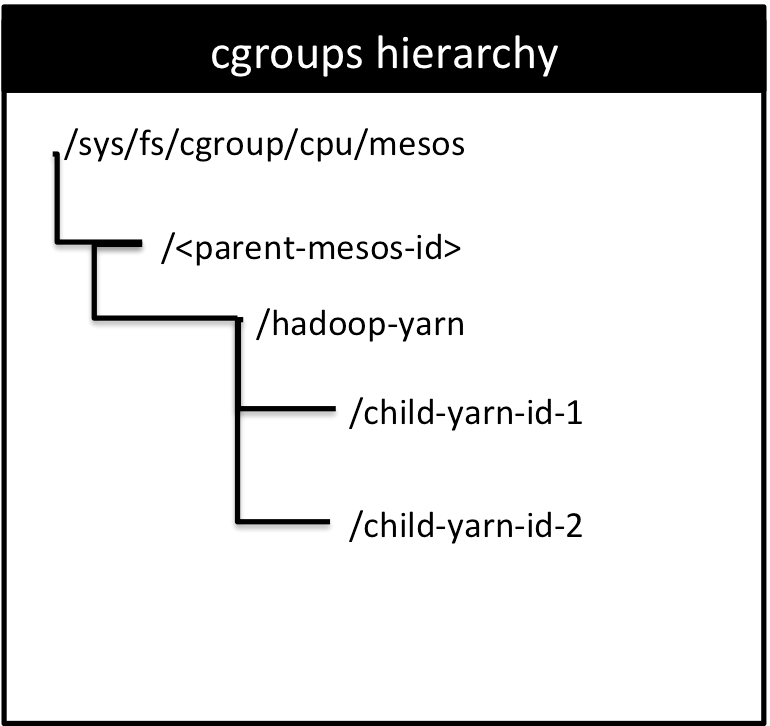

# Cgroups

A node within a cluster is the location where tasks are run. The tasks are launched with help of a daemon which resides inside the node. This daemon, in the case of Mesos, is Mesos Slave, and in case of YARN, is NodeManager.

The cgroups Linux kernel feature allows aggregating/partitioning a set of tasks and their future children into hierarchical groups with respect to one or more subsystems. For example: When cgroups is enabled for the cpu subsystem, and a task is launched by Mesos Slave, it will go under the hierarchy:
```bash
/sys/fs/cgroup/cpu/mesos/<parent-task-id>
```

During the lifecycle of this task, if it launches one or more children, they get mounted under the parent task’s hierarchy and can be configured to only use as much resources as the parent task is allowed to:
```bash
/sys/fs/cgroup/cpu/mesos/<parent-mesos-id>/hadoop-yarn/<child-yarn-id-1>
/sys/fs/cgroup/cpu/mesos/<parent-mesos-id>/hadoop-yarn/<child-yarn-id-2>
```



### Enabling cgroups for mesos-slave

To enable cgroups for mesos-slave, start the slave with following flag:
```bash
--isolation=cgroups/cpu,cgroups/mem
```

### Enabling cgroups for YARN NodeManager

To enable cgroups for YARN NodeManager, add following to ```$YARN_HOME/etc/hadoop/yarn-site.xml```:

```xml
<property>
    <description>who will execute(launch) the containers.</description>
    <name>yarn.nodemanager.container-executor.class</name>
    <value>${yarn.nodemanager.container-executor.class}</value>
</property>
<property>
    <description>The class which should help the LCE handle resources.</description>
    <name>yarn.nodemanager.linux-container-executor.resources-handler.class</name>
    <value>${yarn.nodemanager.linux-container-executor.resources-handler.class}</value>
</property>
<property>
    <name>yarn.nodemanager.linux-container-executor.cgroups.hierarchy</name>
    <value>${yarn.nodemanager.linux-container-executor.cgroups.hierarchy}</value>
</property>
<property>
    <name>yarn.nodemanager.linux-container-executor.cgroups.mount</name>
    <value>${yarn.nodemanager.linux-container-executor.cgroups.mount}</value>
</property>
<property>
    <name>yarn.nodemanager.linux-container-executor.cgroups.mount-path</name>
    <value>${yarn.nodemanager.linux-container-executor.cgroups.mount-path}</value>
</property>
<property>
    <name>yarn.nodemanager.linux-container-executor.group</name>
    <value>${yarn.nodemanager.linux-container-executor.group}</value>
</property>
<property>
    <name>yarn.nodemanager.linux-container-executor.path</name>
    <value>${yarn.home}/bin/container-executor</value>
</property>
```

And, following to ```$YARN_HOME/etc/hadoop/myriad-default-config.yml```:

```yaml
...
nodemanager:
    cgroups: true
...
```

**Please note at time of this writing, YARN's NodeManager only works with CPU subsystem.**
