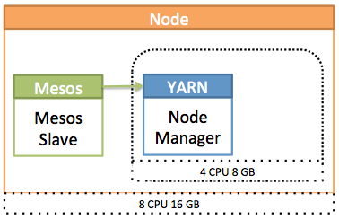

# How it works ?

### Introduction

Myriad allows Mesos and YARN to co-exist and share resources with Mesos as the resource manager for the datacenter. Sharing resources between these two resource allocation systems improves overall cluster utilization and avoids statically partitioning resources amongst two separate clusters/resource managers.

Running two resource managers independently results in a statically partitioned datacenter as shown below:


### Advertising resources: Mesos Slave and YARN’s Node Manager

Mesos Slave and YARN’s Node Manager are processes that run on the host OS, both advertises available resources to Mesos Master and YARN’s Resource Manager respectively. Each process can be configured to advertise a subset of resources. We can leverage this ability, in conjunction with cgroups, to allow Mesos Slave and YARN’s Node Manager to co-exist on a node. The diagram below showcases a node running YARN NodeManager as a Mesos Slave task:



Let Mesos Slave be the processes that advertises all of a node’s resources (8 CPUs, 16 GB RAM) to Mesos Master. Now, let's start YARN Node Manager as a Mesos Task. This task is allotted (4 CPUs and 8 GB RAM), and the Node Manager is configured to only advertise 3 CPUs and 7 GB RAM. The Node Manager is also configured to mount the YARN containers under the [cgroup hierarchy](cgroups.md) which stems from a Mesos task. Ex:

```bash
/sys/fs/cgroup/cpu/mesos/node-manager-task-id/container-1
```

Doing above allows Mesos Slave and Node Manager to co-exist on the same node, in a non-intrusive way. Our architecture leverages this strategy; we'll explore how this fits into the bigger picture.

### High Level Design

One way to avoid static partitioning and to enable resource sharing when running two resource managers, is to let one resource manager be in absolute control of datacenter’s resources. The other resource manager then manages a subset of resources, allocated to it through the primary resource manager. Let's consider a scenario where Mesos is used as the resource manager for the datacenter. In the diagram below, both, Mesos and YARN, can schedule tasks on any node.


Let's look at how we can achieve above, that is, how we can run YARN along side Mesos. The diagram below gives an overview:


Each node in the cluster has both daemons, Mesos slave and YARN node manager, installed. By default, the Mesos slave daemon is started on each node and advertises all available resources to the Mesos Master.

Myriad can launch NodeManager as a task under Mesos Slave, let's look at how:

1. Myriad makes a decision to launch a new NodeManager. It passes the required configuration and task launch information to Mesos Master which forwards that to the Mesos Slave(s). Mesos slave configures Node Manager appropriately before launching it. For ex: In the above diagram, Node Manager is allotted 2.5 CPU and 2.5 GB RAM.
2. NodeManager, upon startup, advertises configured resources to YARN's Resource Manager. In the above example, 2 CPU and 2 GB RAM are advertised.
3. YARN's Resource Manager can launch containers now, via this Node Manager. The launched containers will be mounted under the configured cgroup hierarchy, as explained earlier.
